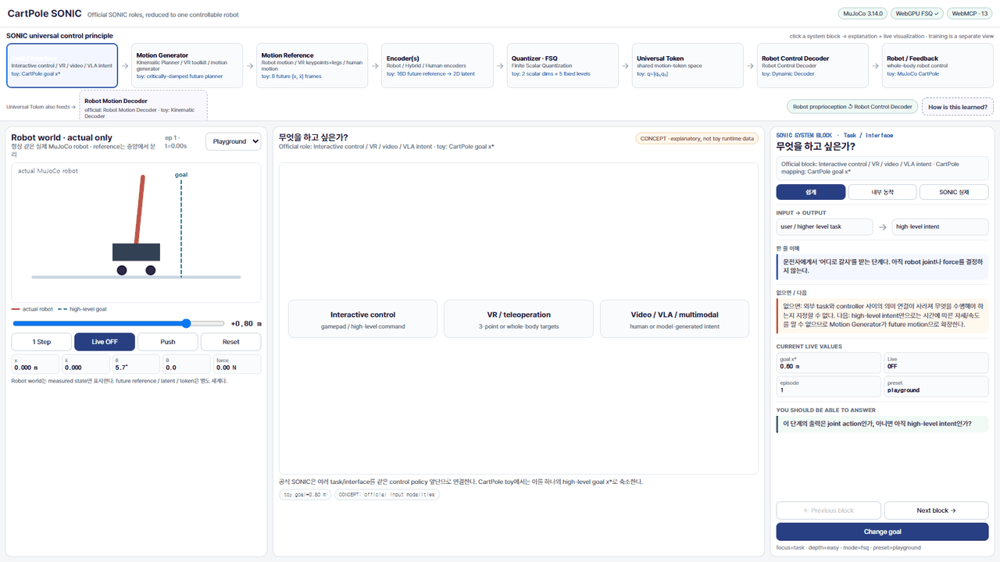
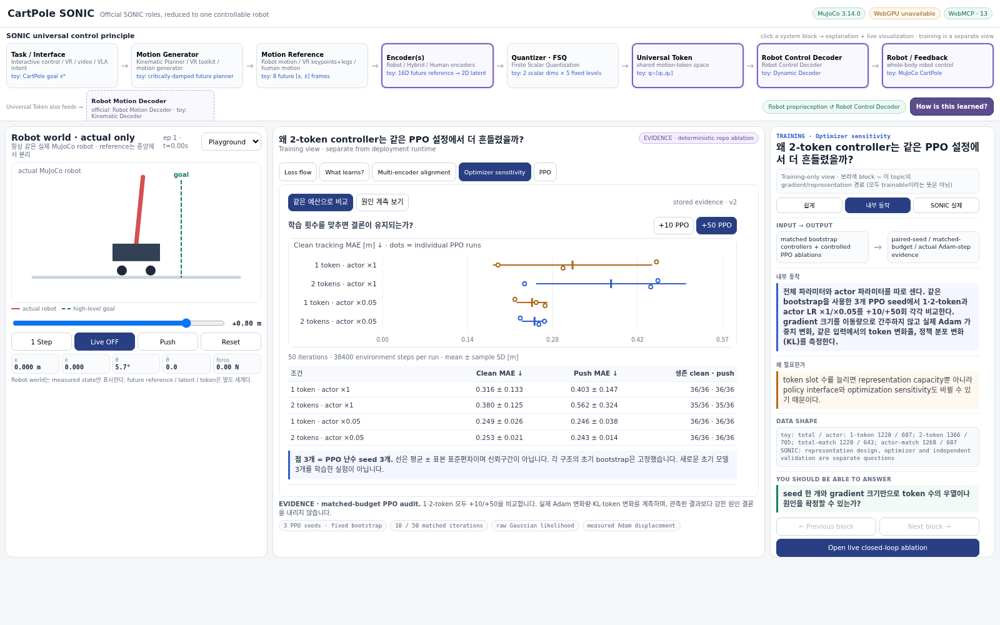
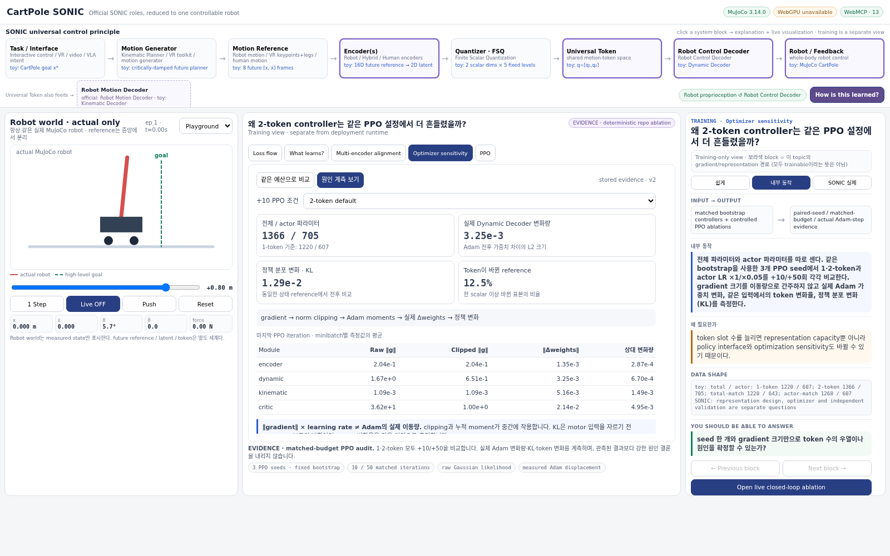

# CartPole SONIC

> An interactive teaching lab that keeps the **SONIC universal-control system map** visible at all times, then explains Encoder/VQ/VQ-VAE/FSQ/token/decoder/training concepts inside the block where they actually belong.

[**Open the live lab →**](https://tinmanlab.github.io/cartpole-sonic/) · [FSQ](https://tinmanlab.github.io/cartpole-sonic/?focus=quantizer&concept=fsq) · [Universal Token](https://tinmanlab.github.io/cartpole-sonic/?focus=token)

<p align="center">
  <a href="https://tinmanlab.github.io/cartpole-sonic/">
    
  </a>
</p>

[High-resolution MP4](media/cartpole-sonic-demo.mp4)

## What this project is

This is **not a reimplementation of GEAR-SONIC's humanoid capability**.

It is a structural teaching model that keeps the control graph intact while replacing a high-DoF humanoid with one CartPole:

```text
high-level goal
      ↓
planner / future reference
      ↓
Encoder
      ↓
latent z
      ↓
VQ or FSQ
      ↓
motion token q
      │
      │      current robot proprioception
      └──────────────┐
                     ↓
              Dynamic Decoder
                     ↓
                   action
                     ↓
              MuJoCo physics
                     ↓
               measured state
```

Two training-only paths are shown separately:

```text
token → Kinematic Decoder → future-motion reconstruction  [auxiliary]
rollout → Critic → GAE / PPO                              [training only]
```

The point is to make each role visible before returning to a full humanoid system.

---

## The first question: why compress and then reconstruct?

This is the core idea behind the Encoder/Decoder lesson.

Suppose the planner provides eight future frames:

```text
[x₁, ẋ₁, x₂, ẋ₂, ... x₈, ẋ₈] = 16 numbers
```

The Encoder maps them into a much smaller latent:

```text
16-D future reference
        ↓ Encoder
     [z₁, z₂]
        2-D
```

Why deliberately throw information away?

Because the bottleneck forces the network to find a **compact representation of what matters for the motion**, instead of copying every input number independently. A compact latent is also easier to discretize into reusable motion tokens.

Then why decode it back to 16-D?

```text
[z₁, z₂]
   ↓ Kinematic Decoder
reconstructed future reference
```

**Not because deployment needs the original input again.**

The reconstruction path is an auxiliary training test:

> “Did the small latent actually retain enough motion information?”

If the Decoder cannot reconstruct the reference, the latent probably discarded useful motion information.

The deployed physical controller uses a different decoder:

```text
motion token + current robot state
              ↓
        Dynamic Decoder
              ↓
            action
```

This distinction is one of the main reasons this lab exists.

---

## Learning structure: SONIC first, prerequisite concepts second

The top of the page now follows the **SONIC system roles** rather than a generic ML study sequence:

```text
Task / Interface
      ↓
Motion Generator
      ↓
Motion Reference
      ↓
Encoder(s)
      ↓
FSQ Quantizer
      ↓
Universal Token
      ├────────→ Robot Motion Decoder      [kinematic / reconstruction path]
      │
      └────────→ Robot Control Decoder + actual proprioception
                                      ↓
                                    Robot
                                      ↓
                                   feedback
```

This mirrors the role structure shown in the SONIC system diagram: diverse task interfaces feed motion generators and motion representations, multiple encoders map those representations through a quantizer into a universal token, and decoders produce robot motion/control outputs.

The page therefore does **not** put AE, VAE, VQ-VAE, “What learns?”, or PPO into the deployment runtime chain.

Instead, click the relevant SONIC block:

| SONIC block | Contextual explanation |
|---|---|
| Encoder(s) | Core Encoder · Autoencoder · **VAE (optional background)** |
| Quantizer · FSQ | VQ · **VQ-VAE** · FSQ |
| Universal Token | token shape, numeric-vector meaning, temporal compression |
| Robot Motion Decoder | live future-motion reconstruction |
| Robot Control Decoder | live token + proprioception → action |
| Robot / Feedback | live reference-vs-actual tracking |
| **How is this learned?** | Loss flow · **What learns?** · Multi-encoder alignment · PPO |

This distinction matters:

- **runtime blocks** answer “what information flows where?”
- **context concepts** answer “why was this representation method invented?”
- **training topics** answer “how do the parameters get learned?”

### Every block has the same three explanation depths

The right-hand guide no longer changes its teaching style from block to block.

```text
쉽게
  → intuition
  → why this block exists
  → what breaks without it
  → why the next block is needed

내부 동작
  → calculation / learning mechanism
  → toy and SONIC data shape
  → current live values

SONIC 실제
  → the actual SONIC role
  → how the CartPole reduction differs
  → common implementation/conceptual mistakes
```

The explanation depth is independent of the center visualization. A learner can keep the same live graph while progressively exposing intuition, mechanics, and actual SONIC structure.

Training topics additionally highlight, in purple on the top SONIC map, the runtime modules whose parameters or signals are involved. For example, multi-encoder alignment highlights Encoder → Quantizer → Universal Token, while PPO highlights Encoder → Robot Control Decoder → Robot/physics.

### What is actually live?

The UI marks every center view explicitly as one of three evidence types:

- **LIVE** — values come from the current CartPole/reference/policy state and update with `1 Step`, `Live`, or a bounded training action
- **EVIDENCE** — deterministic repository ablations loaded from checked evidence files; not presented as current live training
- **CONCEPT** — the toy does not contain that mechanism, so the page shows an explanatory diagram instead of inventing fake runtime data

Current concept-only views are intentionally limited to:

- VAE — SONIC does not use a VAE in this runtime path
- high-level official task modalities — the toy collapses them to one goal scalar
- loss/trainability diagrams — explanatory views of optimization structure

VQ, VQ-VAE live values, FSQ, Universal Token, the 1-vs-2 temporal-slot experiment, both Decoder roles, robot tracking, PPO curves, and the two-Encoder alignment experiment all use real toy state. Optimizer-sensitivity comparisons use checked deterministic **EVIDENCE** snapshots.

---

## Live multi-encoder alignment

The training view now contains a real alignment experiment rather than a concept-only diagram.

The **same future motion** is represented in two different ways:

```text
Representation A
full trajectory
8 frames × [x, ẋ] = 16D
        ↓
Primary Encoder A
frozen anchor

Representation B
sparse keypoints
frames 1,3,6,8 × [x, ẋ] = 8D
        ↓
Secondary Encoder B
trainable
```

Both outputs pass through the **same fixed FSQ** and then the **same Robot Control Decoder with the same proprioception**.

The toy trains only Encoder B with latent alignment MSE:

```text
L_align = || z_B - stopgrad(z_A) ||²
```

and measures three consequences on a deterministic validation set:

- latent MSE ↓
- FSQ token agreement ↑
- same-state action MAE ↓

Current deterministic `+50` alignment-step check:

```text
before
latent MSE       0.1101
token agreement  17.2%
action MAE       0.290 N

after 50 steps
latent MSE       0.00258
token agreement  92.2%
action MAE       0.017 N
```

This is deliberately a **mechanism analogue**, not a claim that sparse CartPole keypoints reproduce G1/SMPL/teleop modalities. Real SONIC jointly aligns multiple modality Encoders with auxiliary alignment losses; the toy freezes Encoder A so the direction of alignment remains easy to see and stable to reproduce.

Direct link:

https://tinmanlab.github.io/cartpole-sonic/?training=alignment&depth=mechanism

---

## Reference, token, and robot state are different things

The live UI deliberately separates them.

```text
Reference world
planner future motion
      ↓
Encoder
      ↓
continuous latent z
      ↓
FSQ
      ↓
motion token q
```

The blue future reference is **upstream of FSQ**. It is not the command sent to the motor.

```text
motion token q       actual robot proprioception
      │                        │
      └──────────┬─────────────┘
                 ↓
          Dynamic Decoder
                 ↓
              action
                 ↓
          actual MuJoCo robot
```

So the semantic roles are:

- **reference** = desired future motion, before Encoder/FSQ
- **latent z** = continuous Encoder output
- **token q** = post-FSQ compact motion representation
- **proprioception** = measured state of the actual robot
- **action** = Dynamic Decoder output applied to the actual robot

For that reason, the Simulation panel now draws only the actual robot. Reference trajectories live in the separate center visualization instead of being overlaid as a ghost robot.

---

## FSQ in one minute

VQ uses a learned vector codebook:

```text
continuous z
     ↓ nearest learned vector
codebook: ● ● ● ● ● ● ● ●
     ↓
discrete q
```

FSQ removes the learned vector lookup.

For this toy, each latent scalar uses five finite levels. The implementation follows the odd-level form of the FSQ reference logic:

```text
qᵢ = round(1.998 · tanh(zᵢ)) / 2
```

So each normalized scalar lands on:

```text
-1, -0.5, 0, 0.5, 1
```

With two scalar dimensions, that gives an implicit (5 × 5 = 25) code space.

FSQ still uses a straight-through estimator for the non-differentiable rounding operation, but it does not need a learned vector codebook, codebook reseeding, or VQ-style commitment machinery.

---

## Visualization behavior

All lessons share the same fixed layout:

- left: **actual MuJoCo robot only**, always the same location and controls
- center: lesson-specific **reference / latent / token / training** visualization
- right: lesson guide
- bottom: stable SONIC information-flow strip

The reference and robot worlds are intentionally separated:

- the Simulation panel never draws a future-reference ghost robot
- planner future motion is **pre-FSQ reference**, not a motor command
- FSQ/VQ produces motion token `q`
- `q + actual proprioception → Dynamic Decoder → action`

For VQ/FSQ latent plots:

- gray points are only the fixed FSQ grid or learned VQ codebook
- the blue trail is the **actual z history generated during the current live episode**
- there is no hypothetical goal sweep mixed into the live graph
- the short dashed `z → q` segment is only the current quantization displacement
- latent x/y axes use equal unit scale (1:1 data aspect)

Canvas backing resolution follows displayed CSS size × device-pixel ratio, so plots are not stretched by mismatched canvas dimensions.

When **Live** is enabled, the robot, current reference, latent, token-dependent visualizations, proprioception, and action are redrawn from the same control ticks. If the CartPole reaches a termination condition, the teaching demo automatically starts a new episode and keeps Live running instead of silently stopping.

**Push** is a robot-only impulse: it changes actual velocity/proprioception without advancing the planner/reference. This makes the Dynamic Decoder experiment explicit:

```text
same reference
same motion token q
      +
changed actual proprioception
      ↓
different action
```

PPO training plots redraw after each training iteration.


---

## What actually learns?

A useful distinction is:

> **FSQ participates in training, but the standard FSQ quantizer itself is not parameter-learned.**

The default SONIC quantizer is `vector_quantize_pytorch.FSQ`, instantiated from a fixed `levels` configuration. It has no learned vector codebook. The rounding operation uses a straight-through estimator (STE), so gradients can pass through the discrete bottleneck to the Encoder.

| Component | Learned? | Main learning signal |
|---|---:|---|
| Motion Encoder(s) | **Yes** | PPO through the Dynamic Decoder + reconstruction auxiliary loss + cross-encoder latent-alignment losses |
| FSQ finite levels / grid | **No** | Fixed hyperparameters; STE provides a surrogate backward path |
| G1 Dynamic Decoder | **Yes** | PPO physical-tracking objective |
| G1 Kinematic Decoder | **Yes** | Future-motion reconstruction auxiliary loss |
| Critic | **Yes** | Value / return loss for PPO |
| VQ learned codebook (comparison) | **Yes** | Codebook/EMA-style update; this is one of the mechanisms FSQ removes |

The subtle point is that the representation still learns even though FSQ does not:

```text
loss
 ↓
Decoder
 ↓
quantized q
 ↓  STE through round()
Encoder weights change
 ↓
next z is placed more usefully relative to the fixed FSQ bins
```

So it is better to say:

- “the **Encoder learns to use FSQ**”
- not “FSQ learns its codebook”

### Actual SONIC token shape

The release configuration uses:

```text
token_dim = 32 scalar dimensions
levels per scalar = 32 fixed values
max_num_tokens = 2

flattened decoder input from tokens = 2 × 32 = 64 values
```

The implementation config names are slightly confusing: `num_fsq_levels: 32` is assigned to `token_dim`, while `fsq_level_list: 32` is broadcast to 32 scalar dimensions.

The implicit Cartesian-product code space is enormous, but it is **not explicitly stored as a table**. Each scalar is quantized independently.

The SONIC decoder consumes the quantized numeric token vectors; “token” here should not be interpreted as necessarily one integer ID like an LLM vocabulary token.

### How are the two temporal token slots formed?

The released MLP Encoder config declares:

```text
num_input_temporal_dims  = num_future_frames
num_output_temporal_dims = max_num_tokens = 2
```

`BaseModule` then flattens the temporal input before the MLP and reshapes the MLP output back into the requested number of output temporal slots. Therefore the implementation is conceptually:

```text
whole future window
(time × features)
      ↓ flatten
one MLP sees the whole window
      ↓
joint latent output
      ↓ reshape
[token slot 1, token slot 2]
      ↓ FSQ
quantized token slots
```

It is **not** hard-coded as:

```text
first half of the window → token 1
second half of the window → token 2
```

Token indices are learned representation slots. A near/far interpretation must be demonstrated empirically rather than assumed from the index.

Implementation anchors:

- [G1 MLP Encoder config](https://github.com/NVlabs/GR00T-WholeBodyControl/blob/main/gear_sonic/config/actor_critic/encoders/g1_mf_mlp.yaml) — future-frame input temporal dims → `max_num_tokens` output temporal dims
- [BaseModule](https://github.com/NVlabs/GR00T-WholeBodyControl/blob/main/gear_sonic/trl/modules/base_module.py) — flattens temporal input before the network and reshapes output after the network
- [UniversalTokenModule](https://github.com/NVlabs/GR00T-WholeBodyControl/blob/main/gear_sonic/trl/modules/universal_token_modules.py) — defines `token_dim`, `max_num_tokens`, FSQ, and flattened decoder token input

### Live 1-token vs 2-token capacity experiment

The Universal Token page now has a `1 vs 2 token slots` experiment. Both toy models receive the **same complete 16-D future window**:

```text
1-token model
16D whole window → Encoder → 1 token × 2 FSQ scalars → Decoder → 16D reconstruction

2-token model
16D whole window → Encoder → reshape to 2 tokens × 2 FSQ scalars → Decoder → 16D reconstruction
```

The models use the same deterministic reference distribution and reconstruction training procedure. The experiment isolates representational capacity; it does **not** claim that two tokens are universally optimal.

At 200 training steps:

```text
                         1 token       2 tokens
reconstruction MSE      0.00831       0.00417
distinct FSQ combos     23            97

2-token / 1-token MSE ≈ 0.50
```

The page also perturbs the early and late halves of the input window and measures the continuous latent change of each token slot. This is a sensitivity diagnostic only. Both slots read the full window, so the UI explicitly warns against labeling slot 1 = near future and slot 2 = far future without evidence.

Direct link:

https://tinmanlab.github.io/cartpole-sonic/?focus=token&concept=temporal&depth=mechanism

---

### Closed-loop 1-token vs 2-token control experiment

The reconstruction experiment above answers only a **representation-capacity** question. It does not prove that the larger token interface produces a better physical controller.

A second live lab therefore connects both tokenizations all the way to native MuJoCo:

```text
1-token controller
16D future → Encoder → FSQ q(2) + proprioception(4) → Dynamic Decoder → force → MuJoCo

2-token controller
16D future → Encoder → reshape 2×2 → FSQ q(4) + proprioception(4) → Dynamic Decoder → force → MuJoCo
```

The comparison deliberately uses matched conditions:

- same future-reference distribution
- same frozen teacher target during a 300-step imitation/bootstrap phase
- same native MuJoCo Playground dynamics
- same PPO iteration budget and hyperparameters
- same deterministic clean and disturbance evaluation seeds

Both bootstrap controllers survive all 12 clean evaluation episodes. Before PPO, performance is similar:

```text
bootstrap              1 token       2 tokens
clean tracking MAE     0.259 m       0.250 m
push post-MAE          0.234 m       0.226 m
```

After the **same +10 PPO iterations**, the result diverges:

```text
+10 PPO                1 token       2 tokens
clean survival         12/12         12/12
clean tracking MAE     0.238 m       0.507 m
push post-MAE          0.215 m       0.579 m
```

So this toy demonstrates an important distinction:

> **More token capacity improved reconstruction, but it did not automatically improve closed-loop control under the same optimization settings.**

The 2-token controller exposes a larger policy interface and more trainable parameters. The experiment intentionally does not retune each controller independently, so it should be read as a **matched-budget optimization ablation**, not as evidence that one token is universally better than two or that SONIC's two-token release design is suboptimal.

The left shared MuJoCo viewport can be driven directly by either controller using `Drive robot: 1 token` or `Drive robot: 2 tokens`. This verifies that the comparison reaches the actual physical control path rather than stopping at reconstruction.

Direct link:

https://tinmanlab.github.io/cartpole-sonic/?focus=token&concept=temporal-control&depth=mechanism

---

### Optimizer audit: what survives a fairer comparison?

Open **How is this learned? → Optimizer sensitivity**. The view now separates **matched-budget results** from **measured optimizer diagnostics**. The evidence is generated by native MuJoCo, not by the chart renderer. Buttons switch the stored +10 / +50 comparisons; these buttons do not train a browser policy. Live training remains in **Universal Token → Closed-loop 1 vs 2**.

#### Correctness before causal interpretation

The audit corrected Gaussian-action bookkeeping in both trainers: the original sampled action is retained for PPO likelihood and score gradients, while only the actuator input is clipped to [-1, 1]. The original single-run ablation had zero sampled-action clipping and its performance values reproduce unchanged after this correction. Thus, this bug was real, but it does **not** explain that original 2-token regression.

Ratio-outside-range fraction is now separate from advantage-dependent objective clipping. Physical failure exactly at the time limit remains terminal. A run that fails before the push now has **null**, not zero, post-push error. Recovery counts identify first tolerance entry, not sustained recovery; unrecovered reached episodes are explicitly capped at 380 control steps.

Adam displacement is measured as `||weights_after - weights_before||₂` after gradient clipping and moment preconditioning. `raw gradient norm × learning rate` is no longer presented as an effective Adam step. The same collected states/references are used to measure fixed-variance raw-Gaussian policy KL and the fraction of references whose quantized token changes.

#### Parameter counts: distinguish total and actor

| Architecture | Total parameters | Actor = Encoder + Dynamic Decoder |
|---|---:|---:|
| 1 token | 1,220 | 607 |
| 2 tokens | 1,366 | 705 |
| 2 tokens, total-parameter match | 1,220 | 643 |
| 2 tokens, actor-parameter match | 1,268 | 607 |

The previous “matched capacity” description was too strong. Neither count matching establishes equal functional capacity: hidden-layer widths and the latent interface still differ. The new actor-matched width control is included as a diagnostic, not a causal isolation of token count.

#### Same budgets, three paired PPO seeds

Each architecture starts from its same stored teacher-bootstrap weights **and Adam moments**. PPO rollout/reset/shuffle seeds are 17011, 27011 and 37011, paired across four conditions. Both token counts use actor scales 1 and 0.05 and receive exactly 10 or 50 iterations: 7,680 or 38,400 environment steps and 240 or 1,200 optimizer minibatches per run. The critic and auxiliary-decoder scales remain 1.

Evaluation uses the same 12 clean episodes (seed 18181) and 12 push episodes (seed 19191) for each run. These differ from the legacy exploratory evaluation seeds 8181/9191, so the following numbers must not be compared as though only the PPO seed changed.

**Mean ± sample standard deviation over three PPO runs [m].** This is conditional on one fixed bootstrap per architecture, not three independent model initializations or a confidence interval. Clean MAE is conditional on episode completion; survival is shown alongside it. The 36 episode evaluations repeat the same 12 scenarios across three runs and are not 36 independent evaluation scenarios.

| PPO iterations | Condition | Clean MAE ↓ | Post-push MAE ↓ | Survival clean · push |
|---:|---|---:|---:|---:|
| 10 | 1 token · actor ×1 | 0.260 ± 0.065 | 0.373 ± 0.057 | 36/36 · 36/36 |
| 10 | 2 tokens · actor ×1 | 0.244 ± 0.015 | 0.308 ± 0.037 | 36/36 · 36/36 |
| 10 | 1 token · actor ×0.05 | 0.237 ± 0.021 | 0.272 ± 0.035 | 36/36 · 36/36 |
| 10 | 2 tokens · actor ×0.05 | 0.244 ± 0.010 | 0.269 ± 0.013 | 36/36 · 36/36 |
| 50 | 1 token · actor ×1 | 0.316 ± 0.133 | 0.403 ± 0.147 | 36/36 · 36/36 |
| 50 | 2 tokens · actor ×1 | 0.380 ± 0.125 | 0.562 ± 0.324 | 35/36 · 35/36 |
| 50 | 1 token · actor ×0.05 | 0.249 ± 0.026 | 0.246 ± 0.038 | 36/36 · 36/36 |
| 50 | 2 tokens · actor ×0.05 | 0.253 ± 0.021 | 0.243 ± 0.014 | 36/36 · 36/36 |

At +10, the default 2-token mean is lower than the default 1-token mean on this repeated-seed evaluation, unlike the legacy single run. At +50, default-rate runs vary substantially; the default 2-token condition also loses one clean and one push episode. Smaller actor steps reduce the observed run-to-run spread for **both** token counts. They do not establish a universal optimal learning rate, automatic improvement over bootstrap, or superiority of two tokens.

The safe conclusion is narrower than “the larger interface is inherently unstable” or “actor LR is the dominant cause”: **training randomness, budget and optimizer settings matter; the existing results do not isolate a token-count cause.** The UI shows individual-run dots, mean/standard-deviation markers, survival, exact per-seed values, and module-by-module Adam measurements. The last-iteration KL is a local change diagnostic, not a guarantee of long-horizon control quality.

Reproduce or verify:

```bash
npm run evaluate:optimization  # explicitly regenerate measured evidence
npm run verify:contracts      # numerical/action/evaluation contracts and evidence shape
npm run verify:optimization   # rerun every variant/seed and compare all stored measurements
```

Verification is hypothesis-neutral: it checks source/asset hashes, budgets, numerical measurements and deterministic replay, **not that a chosen architecture must win**. Independent bootstrap initialization, additional evaluation scenarios, a separated tuning/validation procedure, and larger motion/dynamics distributions remain outside this small conditional study.

Implementation references (principles, not copied production SONIC code):

- [CleanRL continuous-action PPO](https://github.com/vwxyzjn/cleanrl/blob/master/cleanrl/ppo_continuous_action.py): raw Gaussian samples/log probabilities, environment-side action clipping, ratio clipping and sampled KL diagnostics.
- [PyTorch Adam documentation](https://docs.pytorch.org/docs/stable/generated/torch.optim.Adam.html): clipped/raw gradient norm is not the actual moment-preconditioned parameter displacement.

Direct link: https://tinmanlab.github.io/cartpole-sonic/?training=optimizer-sensitivity&depth=mechanism

---

### Why do different encoders produce a universal token?

FSQ alone does not guarantee that a G1 Encoder, SMPL Encoder, and teleoperation Encoder give the same semantic token.

SONIC trains these encoders with auxiliary latent-alignment losses in addition to physical PPO and reconstruction. The released auxiliary configuration includes G1↔SMPL, G1↔teleop, teleop↔SMPL, and re-encoded SMPL↔G1 alignment terms.

This is a key part of the word **universal**.

Official implementation references:

- [UniversalTokenModule](https://github.com/NVlabs/GR00T-WholeBodyControl/blob/main/gear_sonic/trl/modules/universal_token_modules.py)
- [SONIC training code](https://github.com/NVlabs/GR00T-WholeBodyControl/blob/main/docs/source/references/training_code.md)
- [FSQ config](https://github.com/NVlabs/GR00T-WholeBodyControl/blob/main/gear_sonic/config/actor_critic/quantizers/fsq.yaml)
- [Universal-token config](https://github.com/NVlabs/GR00T-WholeBodyControl/blob/main/gear_sonic/config/actor_critic/universal_token/all_mlp_v1.yaml)
- [Auxiliary-loss config](https://github.com/NVlabs/GR00T-WholeBodyControl/blob/main/gear_sonic/config/aux_losses/universal_token/g1_recon_and_all_latent.yaml)

---

## Questions the learner should now be able to ask

These are intentional checkpoints, not extra jargon:

1. **Why compress at all?** What information do we want the bottleneck to retain?
2. **Why reconstruct if the deployment controller does not need reconstruction?**
3. **What is the difference between latent dimension, FSQ levels per dimension, number of tokens, and flattened token dimension?**
4. **Does FSQ learn anything? If not, how does gradient reach the Encoder?**
5. **Why can a fixed quantizer improve during training?**
6. **Is a SONIC motion token an integer ID or a quantized numeric vector?**
7. **Why does a motion token not contain the current robot state?**
8. **Why does the Dynamic Decoder need proprioception in addition to the token?**
9. **What teaches the Dynamic Decoder: reconstruction or PPO?**
10. **What teaches the Kinematic Decoder?**
11. **How do G1, SMPL, and teleop Encoders learn a compatible shared token space?**
12. **Where does the reference come from, and is that reference source itself part of the SONIC tracker?**
13. **How is temporal information compressed into multiple tokens?**
14. **Which parts exist at deployment, and which exist only during training?**
15. **Why can a larger token interface require different actor optimization even when reconstruction improves?**
16. **What does this CartPole toy preserve, and what humanoid behavior can it not validate?**

If those questions can be answered from the UI without reading source code, the teaching lab is doing its job.

---

## Quick start

### 1. Fastest: use GitHub Pages

Open:

**https://tinmanlab.github.io/cartpole-sonic/**

Useful direct links:

- System start / Task: https://tinmanlab.github.io/cartpole-sonic/?focus=task
- Motion Generator: https://tinmanlab.github.io/cartpole-sonic/?focus=generator
- Motion Reference: https://tinmanlab.github.io/cartpole-sonic/?focus=reference
- Encoder core: https://tinmanlab.github.io/cartpole-sonic/?focus=encoder
- Autoencoder: https://tinmanlab.github.io/cartpole-sonic/?focus=encoder&concept=ae
- VAE optional background: https://tinmanlab.github.io/cartpole-sonic/?focus=encoder&concept=vae
- VQ: https://tinmanlab.github.io/cartpole-sonic/?focus=quantizer&concept=vq
- VQ-VAE: https://tinmanlab.github.io/cartpole-sonic/?focus=quantizer&concept=vqvae
- FSQ: https://tinmanlab.github.io/cartpole-sonic/?focus=quantizer&concept=fsq
- Universal Token: https://tinmanlab.github.io/cartpole-sonic/?focus=token
- 1 vs 2 temporal token slots: https://tinmanlab.github.io/cartpole-sonic/?focus=token&concept=temporal&depth=mechanism
- Closed-loop 1 vs 2 token control: https://tinmanlab.github.io/cartpole-sonic/?focus=token&concept=temporal-control&depth=mechanism
- Robot Motion Decoder: https://tinmanlab.github.io/cartpole-sonic/?focus=motion-decoder
- Robot Control Decoder: https://tinmanlab.github.io/cartpole-sonic/?focus=control-decoder
- Robot / Feedback: https://tinmanlab.github.io/cartpole-sonic/?focus=robot
- What learns?: https://tinmanlab.github.io/cartpole-sonic/?training=what-learns
- Optimizer sensitivity: https://tinmanlab.github.io/cartpole-sonic/?training=optimizer-sensitivity&depth=mechanism
- Multi-encoder alignment: https://tinmanlab.github.io/cartpole-sonic/?training=alignment
- PPO: https://tinmanlab.github.io/cartpole-sonic/?training=ppo

### 2. Run locally

No build step is required for the web app.

```bash
git clone https://github.com/tinmanlab/cartpole-sonic.git
cd cartpole-sonic
python3 serve.py
```

Open:

```text
http://localhost:8765
```

For development checks:

```bash
npm ci
npm run check
npm run verify:teacher
npm run verify:bootstrap
npm run verify:ppo
```

---

## Native MuJoCo WASM

The browser physics is real MuJoCo, not a hand-written CartPole equation.

The repo vendors the official MuJoCo 3.14.0 JavaScript/WASM build under:

```text
vendor/mujoco/
├── mujoco.js
├── mujoco.wasm
└── LICENSE
```

The default model follows the relevant MuJoCo Playground / dm_control CartPole settings:

- simulation timestep: 10 ms
- cart mass: 1.0 kg
- pole mass: 0.1 kg
- slide range: ±1.8 m
- motor force interface: ±10 N

Two additional bounded variants are included for dynamics/morphology experiments:

- Long pole
- Heavy pole

These are teaching variants, not official Playground benchmark tasks.

---

## WebMCP

The semantic API follows the same SONIC system map shown in the UI:

```text
sonic_get_map
sonic_get_state
sonic_focus
sonic_open_training
sonic_set_explanation_depth
sonic_run_focus_action
simulation_control
experiment_set_goal
training_run
alignment_control
temporal_token_control
temporal_control_control
simulation_set_model
```

`course.js` is the single source of truth for:

- runtime SONIC blocks
- contextual concept tabs
- separate training topics
- official-role ↔ CartPole-role mapping

Examples:

```text
sonic_focus({node_id:"encoder", concept_id:"ae"})
sonic_focus({node_id:"quantizer", concept_id:"vqvae"})
sonic_focus({node_id:"token"})
sonic_set_explanation_depth({depth:"mechanism"})
sonic_open_training({topic_id:"what-learns"})
sonic_open_training({topic_id:"alignment"})
alignment_control({action:"train", steps:50})
sonic_focus({node_id:"token", concept_id:"temporal"})
temporal_token_control({action:"train", steps:200})
sonic_focus({node_id:"token", concept_id:"temporal-control"})
temporal_control_control({action:"select", controller:"two"})
temporal_control_control({action:"train", steps:10})
sonic_open_training({topic_id:"optimizer-sensitivity"})
```

The map payload also includes the same structured explanations used by the UI: intuition, mechanism, actual SONIC mapping, failure-if-removed, transition-to-next-block, and toy/SONIC data shapes.

`sonic_get_state` returns the currently focused system block plus the actual signals and current explanation depth:

```text
reference       = desired future motion before FSQ
latent          = continuous Encoder output
token           = post-VQ/FSQ numeric motion representation
proprioception  = measured actual robot state
action          = Robot Control Decoder output
```

This makes agent navigation match the learner's conceptual map instead of exposing a second, unrelated lesson hierarchy.

---

## WebGPU

WebGPU is intentionally separated from the tiny PPO trainer so the project does not pretend that GPU acceleration is necessary for this small model.

After the lesson UI is visible, `webgpu_fsq.js` asynchronously runs the actual FSQ scalar transform in a WebGPU compute shader:

```wgsl
dst[i] = round(tanh(src[i]) * 1.998) / 2.0;
```

It compares the GPU result with the CPU reference and reports parity in the top status badge.

Current roles:

- **MuJoCo WASM**: physical simulation
- **JavaScript/CPU**: tiny PPO / teacher / MLP training
- **WebGPU**: real FSQ compute parity and browser-GPU capability verification
- **WebMCP**: semantic agent control

This keeps each technology's role explicit.

---

## Fast startup checkpoints

The teaching UI does not recompute the 500-step teacher bootstrap on every page load.

Deterministic bootstrap checkpoints are bundled for the default continuous/VQ/FSQ students, plus a matched 1-token/2-token closed-loop control checkpoint used by the control ablation. They are loaded immediately so the relevant visualization is usable without recomputing teacher imitation on page entry. PPO iterations run after that remain live browser-side learning.

If a checkpoint is unavailable, the lab can fall back to the teacher bootstrap path.

---

## Bundled teacher and PPO

A frozen CartPole PPO artifact is included only as a **lab bootstrap teacher**.

It is not a GEAR-SONIC component.

Why use it?

A completely random discrete-token policy often fails before the student can learn a useful physical controller. The teacher gives the toy student a stable initial action prior; the student is then improved using its own SONIC-like tracking PPO loop.

Deterministic native-MuJoCo evidence is stored in `evidence/`.

Current checked results:

| Stage | Result |
|---|---:|
| frozen teacher stability | 15 / 15 episodes survive 10 s |
| teacher ±0.8 m precision | ~0.42 m MAE |
| FSQ student after bootstrap | 12 / 12 survive 10 s, ~0.201 m MAE |
| FSQ student + 20 PPO iterations | ~0.144 m MAE |
| FSQ student + 30 PPO iterations | ~0.142 m MAE |
| FSQ student + 50 PPO iterations | regresses to ~0.192 m MAE |
| two-Encoder alignment +50 steps | latent MSE 0.110 → 0.00258, token agreement 17.2% → 92.2% |
| temporal capacity +200 steps | 2-token reconstruction MSE ~50% of 1-token |
| matched closed-loop +10 PPO | 1-token 0.238 m MAE, 2-token 0.507 m MAE |

These are **toy CartPole measurements**, not NVIDIA SONIC benchmark results. The alignment and temporal-token experiments are mechanism ablations, not claims about real G1/SMPL/teleop or globally optimal token counts.

---

## Mapping back to GEAR-SONIC

| CartPole SONIC | GEAR-SONIC role |
|---|---|
| future [x, ẋ] trajectory | future whole-body motion reference |
| tiny reference Encoder | G1 / SMPL / teleop motion Encoder |
| 2-D latent | learned motion latent |
| VQ / FSQ | discrete motion bottleneck |
| compact q | universal motion-token representation |
| [x, ẋ, θ, θ̇] | robot proprioception |
| Dynamic Decoder | G1 dynamic decoder |
| scalar force | whole-body joint action |
| MuJoCo CartPole | humanoid physics / robot |
| Kinematic Decoder | future-motion reconstruction auxiliary path |
| Critic + GAE + PPO | physical tracking policy optimization |

What this toy **does not** reproduce:

- G1 morphology and multi-contact dynamics
- the production SONIC network size
- real G1/SMPL/teleop modality alignment (the repo contains a two-representation CartPole alignment analogue, not those production modalities)
- large-scale motion data
- real actuator/sensor dynamics
- sim-to-real deployment quality
- VLA / teleoperation production interfaces

---

## Repository structure

```text
.
├── index.html                 # interactive UI
├── app.js                     # fixed teaching shell + WebMCP orchestration
├── course.js                  # canonical SONIC system-map / concept SSOT
├── sonic_toy.js               # SONIC-like planner/encoder/token/decoder/PPO
├── alignment_lab.js           # live two-Encoder representation-alignment experiment
├── temporal_token_lab.js      # live 1-token vs 2-token reconstruction/capacity experiment
├── temporal_control_lab.js    # live closed-loop control + measured PPO diagnostics
├── optimizer_evidence_view.js # matched-budget dots/SD, exact runs and Adam diagnostics
├── mujoco_sim.js              # native MuJoCo WASM CartPole wrapper
├── webgpu_fsq.js              # WebGPU FSQ parity kernel
├── teacher_policy.js          # frozen bootstrap teacher adapter
├── assets/
│   ├── teacher_cartpole_ppo.json
│   ├── student_ae_bootstrap.json
│   ├── student_vq_bootstrap.json
│   ├── student_fsq_bootstrap.json
│   └── temporal_control_bootstrap.json
├── evidence/                  # deterministic evaluation snapshots, including temporal_control_eval.json and control_optimization_eval.json
├── scripts/                   # structure, deterministic evaluation, and optimizer-ablation checks
├── vendor/mujoco/             # pinned MuJoCo 3.14.0 JS/WASM
└── media/
    ├── cartpole-sonic-demo.gif
    └── cartpole-sonic-demo.mp4
```

---

## References

- NVIDIA GEAR-SONIC: https://nvlabs.github.io/GEAR-SONIC/
- NVIDIA GR00T Whole-Body Control: https://github.com/NVlabs/GR00T-WholeBodyControl
- ProtoMotions: https://github.com/NVlabs/ProtoMotions
- FSQ — *Finite Scalar Quantization: VQ-VAE Made Simple*: https://arxiv.org/abs/2309.15505
- MuJoCo: https://github.com/google-deepmind/mujoco
- MuJoCo Playground: https://github.com/google-deepmind/mujoco_playground

## Scope

This repository is a learning and research prototype. Its goal is to make the architecture understandable and inspectable, not to claim performance equivalence with GEAR-SONIC or a production humanoid controller.

### v1.1.0 browser and measurement audit

Encoder gradients combine PPO and reconstruction auxiliary terms. Scaling its learning rate changes both contributions; “actor LR” here is not a policy-gradient-only intervention. Critic and auxiliary-decoder learning-rate scales remain 1.

Local periodic `/telemetry` now sends a bounded summary rather than repeatedly serializing full checkpoints and static evidence. Full evidence remains available on explicit `sonic_get_state` reads and in the evidence JSON. The browser audit checks real delivery under the 64 KiB request budget, live two-token force/state changes, matched PPO, reset, 13 registered-tool names, and desktop layout/navigation. Long explanations scroll instead of being silently clipped.




