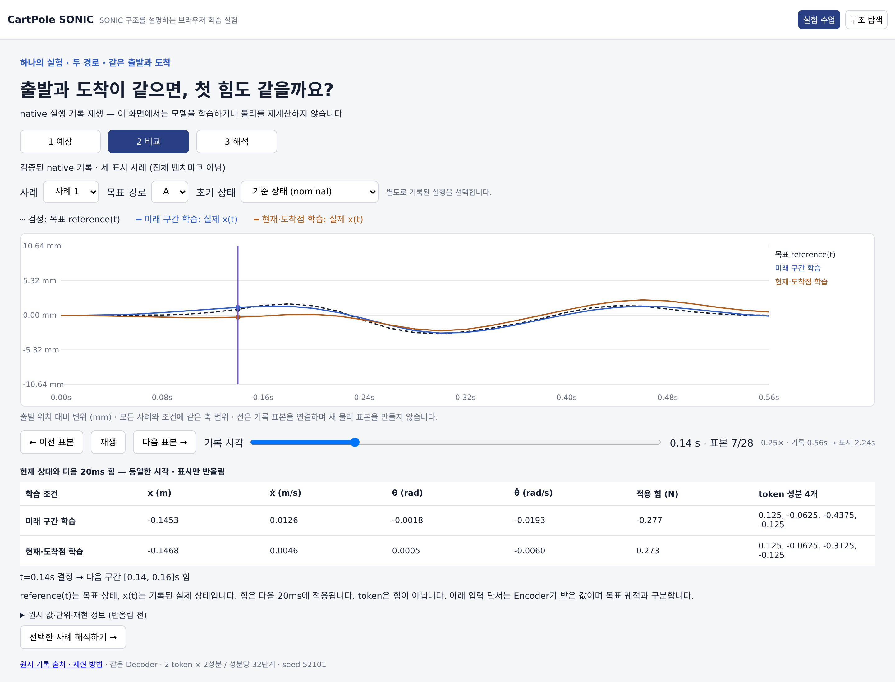

# CartPole SONIC — 작은 로봇으로 이해하는 동작 표현과 제어

[실험 수업 시작](https://tinmanlab.github.io/cartpole-sonic/?lesson=future) ·
[구조 탐색·실시간 교육용 시뮬레이션](https://tinmanlab.github.io/cartpole-sonic/?focus=task)



**먼저 예측하고, 같은 시각의 기록을 비교하고, 결과를 설명하는 공개 실험 수업입니다.** 첫 질문은 “출발과 도착이 같으면 첫 힘도 같을까?”입니다. 현재·도착점만으로 구별할 수 없는 중간 경로를 실제 기록으로 확인합니다.

첫 화면은 **Python/native에서 수행한 실험 기록의 재생**입니다. 재생·시간 이동·초기 상태 선택은 기록을 고르는 조작이며, 브라우저에서 모델을 학습하거나 물리를 다시 계산하지 않습니다. **구조
탐색**으로 전환하면 기존 JavaScript 교육용 제어 모델과 MuJoCo WASM을 실시간으로 실행합니다. 두 실행을 혼동하거나 화면을 바꾼 사이 숨겨진 로봇이 계속 움직이지 않도록 구분합니다.

### 한 수업에서 끝까지 확인하는 것

**예상:** 현재 상태와 도착점만으로 두 중간 경로를 구별할 수 있을까요? 답을 고르거나 바로 비교로 넘어갈 수 있습니다.

**비교:** 같은 목표에 대해 미래 구간으로 학습한 정책과 현재·도착점으로 학습한 정책의 실제 위치·token·힘을 같은 시간축에서 읽습니다. 기록은 0.56초이며 느린 재생은 관찰 속도만 바꿉니다. 마지막
표본에는 새 행동이 없으므로 힘 0으로 표시하지 않습니다.

**해석:** 완주와 추적 오차가 같은 의미인지, 초기 실제 상태를 바꾸면 차이가 유지되는지 확인합니다. 조건 선택은 미리 실행한 별도의 기록입니다. 이 수업의 세 사례 수치를 전체 실험 평균이나 실물 로봇의 성능으로 읽지 않습니다.

[원래 실험·기록 선택·재현 방법](native/GUIDED_LESSON.md) · [전체 비교 결과](native/MATCHED_CUES.md)

## 1. 목표에서 행동까지

```text
사용자가 지정한 목표 위치
           ↓
Motion Generator — 앞으로 따라갈 위치·속도 reference 생성
           ↓
Encoder — reference를 작은 연속 표현 z로 변환
           ↓
FSQ — 각 성분을 정해진 단계로 양자화하여 token q 생성
           ↓
Dynamic Decoder ← 현재 위치·속도·막대 각도·각속도
           ↓
카트에 적용할 힘
           ↓
MuJoCo에서 다음 상태 계산 → 다음 제어 입력으로 되먹임
```

별도의 **Kinematic Decoder**는 token에서 reference를 복원합니다. 복원 오차는 움직임 정보가 얼마나 남았는지 검사하고 학습을 보조합니다. 이 Decoder가 카트에 힘을 주는 것은 아닙니다.

**PPO는 구조의 이름이 아니라 학습 방법입니다.** 물리 시뮬레이션에서 모은 상태·행동·보상으로 정책을 갱신합니다. 작은 token, 낮은 복원 오차, PPO 학습 완료 중 어느 하나만으로 좋은 제어가 보장되지는 않습니다.

## 2. 화면의 값과 출처

**구조 탐색 화면에서** 왼쪽은 브라우저 제어기가 구동하는 시뮬레이션, 가운데는 선택한 개념의 시각화, 오른쪽은 설명입니다. 현재 제어기 표시와 자료 출처를 함께 확인하세요.

| 표시 | 뜻 | 뜻하지 않는 것 |
|---|---|---|
| 기록 재생 | 선택한 native 실행에서 기록된 같은 시각의 값 | 지금 브라우저에서 Python 물리를 재계산한다는 뜻 |
| LIVE | 지금 브라우저 교육용 모델에서 계산한 값 | 공식 Python 실험을 실행 중이라는 뜻 |
| EVIDENCE | 파일로 보존된 실험 결과 | 왼쪽 로봇의 현재 성능 |
| CONCEPT | 구조를 설명하는 자료 | 모든 블록이 현재 제어기에 포함됐다는 뜻 |
| 목표 위치 | 원하는 최종 위치 | 현재 reference 또는 실제 위치 |
| 현재 reference | 같은 시각에 따라가야 할 계획 | 80ms 뒤의 미리보기 |
| 다음 힘 | 현재 상태로 예측한 다음 행동 | 이미 적용한 마지막 힘 |
| 마지막 적용 힘 | 직전 물리 step에 보낸 힘 | 아직 적용하지 않은 예측 |

추적 오차는 **같은 시각의 실제 위치와 reference**를 비교합니다. 미래 프레임은 Encoder 입력과 미리보기이며, 현재 위치에서 80ms 뒤 reference를 뺀 값을 현재 오차로 표시하지 않습니다.
구조 탐색은 위치를 1.8 m, 속도를 3.0 m/s로 나눈 reference를 사용합니다. 이 위치·속도 벡터의 복원 MSE는 **무차원**입니다. Native 카트 위치 MAE의 m·mm와 별개 지표입니다.

그림은 계산된 상태를 보여 주는 **단순화된 2D 도식**입니다. 바퀴·색·배율은 실제 하드웨어나 상세 메시의 검증 자료가 아닙니다. 긴 막대 preset에서도 물리 길이는 유지하고 화면 배율만 조정합니다.

## 3. 구조 탐색의 실시간 조작

목표를 정하고 **한 단계**로 상태와 힘의 변화를 확인하세요. **계속 실행/일시정지**는 같은 제어 step을 연속해서 진행하거나 멈춥니다. 목표를 바꿔도 물리 step 없이는 로봇이 순간 이동하지 않습니다.

**외란**은 reference를 바꾸지 않고 실제 속도를 변경합니다. 현재 상태가 달라졌을 때 다음 힘이 어떻게 달라지는지 살펴보세요.

| 조작 | 바뀌는 것 | 유지되는 것 |
|---|---|---|
| 한 단계 / 계속 실행 | 물리 상태와 실행 시간 | 학습된 모델 가중치 |
| 외란 | 카트·막대 속도 | 그 시각의 reference와 모델 |
| 로봇 상태 초기화 | 물리 내부 상태, reference 진행, 실패 상태 | 학습된 모델 가중치 |
| PPO 학습 | 표시된 학습 대상의 가중치 | 다른 비활성 정책 |
| 1-token/2-token 비교 학습 | 두 비교 모델을 같은 횟수로 갱신 | 일반 교육용 정책 |
| 학습 기준 복원 | 해당 비교의 제공된 checkpoint로 복원 | 다른 실험과 구분 |

**현재 제어기**는 왼쪽 시뮬레이션을 구동하는 모델입니다. **학습 대상**은 갱신 작업이 대상으로 삼은 모델입니다. 작업 성공 여부와 함께 확인하세요. 별도의 표현 정렬·복원 실험과 저장된 native 자료는 현재 브라우저 정책과 다릅니다.

물리 실패 기준에 도달하면 한 단계와 연속 실행 모두 멈추며, 상태 초기화 후 다시 진행합니다. 실패를 감추는 자동 재시작은 하지 않습니다. 잘못된 숫자·차원·모델은 사전 검사에서 거부합니다. 작업 오류가 나도 실행
중 잠금이 남지 않게 하며, 학습 중 대상을 바꾸는 조작은 중복 실행하지 않습니다.

AE는 양자화하지 않는 연속 표현입니다. VQ/FSQ와 1-token/2-token 경로는 상단의 실제 제어기 표시를 확인하세요. VAE 설명은 배경 개념이며 공식 SONIC이 VAE로 바뀌었다는 뜻이 아닙니다.

브라우저와 native는 별도 실행 경로입니다. 제어·학습의 상세 경계는 [TRAINING.md](native/TRAINING.md), 측정값의 해석은 각 실험 문서에서 확인하세요.

## 4. 차원과 물리 조건

일반 브라우저 경로는 `+0.08 … +0.64초`의 미래 위치·속도 **8프레임 × 2성분 = 16개 수**를 받습니다. Native 기록 경로의 `0.00 … 0.56초` 입력과 시각 범위가 다릅니다. 기본
FSQ는 **2개 scalar로 된 token 하나**, 2-token 비교 모델은 **2 tokens × 2 scalars = 4개 수**를 사용합니다. 두 token slot이 각각 가까운 미래와 먼 미래를
맡도록 정해진 것은 아닙니다. 현재 선택한 모델의 차원을 기본 예제의 차원과 혼동하지 않습니다.

숫자가 16개라고 정보의 자유도가 16개인 것은 아닙니다. 기본 reference는 목표와 시간으로 생성하는 제한된 곡선 집합입니다. 여기서 잘 복원했다고 복잡한 휴머노이드 동작 전체를 같은 크기로 표현할 수 있다는 뜻은 아닙니다.

| 항목 | 브라우저 설정 |
|---|---|
| 물리 엔진 | MuJoCo JavaScript/WebAssembly |
| 물리 시간 간격 | 0.01초 |
| 제어 간격 | 물리 2 step마다 1회, 0.02초 / 50Hz |
| 상태 순서 | 카트 위치, 카트 속도, 막대 각도, 막대 각속도 |
| 내부 단위 | m, m/s, rad, rad/s; 화면의 각도 변환은 별도 표시 |
| 행동 | 카트 힘, 최대 ±10N |
| 기본 모델 | 카트 1kg, 막대 0.1kg, 이동 범위 ±1.8m |
| 물리 실패 | 카트 위치 절댓값 1.78m 초과 또는 막대 각도 절댓값 0.65rad 초과 |

`Long pole`과 `Heavy pole`은 조건 변화용 교육 preset입니다. 다른 preset이나 학습 범위 밖의 목표에서 기본 모델의 저장된 성능을 보장하지 않습니다. 카트 힘 하나로 막대까지
움직이므로 카트 궤적과 막대 각도를 각각 임의로 명령할 수 없습니다.

## 5. 공식 SONIC 코드의 별도 실험

Native 경로는 고정된
[공식 SONIC 소스](https://github.com/NVlabs/GR00T-WholeBodyControl/tree/b042411fae38ee4d1af9aac82a37a1f8d14d6dd0)를 직접
불러옵니다. 원본 파일, FSQ 설정, 입출력, 학습 경로와 실험 증거를 확인합니다.

| 질문 | 방법과 결과 |
|---|---|
| 공식 모듈을 실제로 사용하는가? | [입출력·역전파 검사](native/README.md) |
| 공식 학습기를 물리에 연결했는가? | [원본 PPO trainer와 환경 경계](native/TRAINING.md) |
| 균형과 목표 추적을 구분했는가? | [정책 학습과 reference 제거 비교](native/LEARNING.md) |
| 다른 입력이 같은 Decoder를 사용하는가? | [다중 Encoder·공유 Decoder·복원](native/CONCEPTS.md) |
| 같은 현재·끝점에서도 미래를 구분하는가? | [물리적으로 가능한 같은 끝점 궤적](native/TEMPORAL_AUDIT.md) |
| 입력별로 공정하게 학습해도 차이가 남는가? | [동일 예산·새 궤적·관측 정보 검사](native/MATCHED_CUES.md) |
| 언제 다른 로봇이 필요한가? | [최소 로봇 전환 기준](native/PIVOT.md) |

실험마다 목표·데이터·초기화·학습·평가 시간이 다릅니다. 기록 궤적 재생의 mm 오차와 목표 위치 추적의 cm 오차를 같은 지표처럼 비교하지 않습니다. 완주한 episode만의 오차에는 완주율을 함께 봅니다. 외란
전에 실패했다면 외란 회복은 0이 아니라 미관측입니다.

여러 Encoder 초기화는 전체 제어기를 여러 번 독립 학습한 결과가 아닙니다. 깨끗한 marker 좌표도 실제 카메라나 VR 관측과 다릅니다. 휴머노이드 성능, 장시간 안정성, 실제 센서·하드웨어 또는
sim-to-real 검증을 주장하지 않습니다.

## 6. 직접 실행과 검증

공개 학습장을 바로 열거나, 로컬 HTTP 서버를 사용하세요. `file://`로 HTML을 열면 모듈·WASM 로딩이 제한될 수 있습니다.

```bash
git clone https://github.com/tinmanlab/cartpole-sonic.git
cd cartpole-sonic
npm ci
python3 -m http.server 8765 --bind 127.0.0.1
```

브라우저에서 `http://127.0.0.1:8765`를 엽니다. 선택적인 로컬 telemetry는 `serve.py`로 사용할 수 있지만, 개발 서버를 인증 없이 외부 네트워크에 공개하는 배포 방법으로 사용하지 않습니다.

```bash
npm run check
npm run verify:contracts
npm run verify:execution
npx --no-install playwright install chromium
npm run verify:browser
npm run verify:browser-execution
npm run verify:browser-lesson
```

브라우저 검사는 잠깐 사용하는 로컬 HTTP 서버를 직접 열고 닫습니다. CI도 실제 Chromium에서 화면·도구·실패·복구 경로를 실행합니다. 저장된 캡처와 현재 실행을 별개의 증거로 남깁니다.

Python 실험은 [native 실행 안내](native/README.md)와 [학습 환경 안내](native/TRAINING.md)의 분리된 CPU 환경을 따릅니다. 개인 PC 경로나 비공개 프로젝트 접근이 실행 전제는 아닙니다.

## 7. 기술별 역할

**MuJoCo WASM**은 물리를, **JavaScript/CPU**는 교육용 추론과 작은 학습을 수행합니다. **WebGPU**는 FSQ의 CPU/GPU 일치 검사이며 전체 학습을 GPU로 실행한다는 뜻이
아닙니다. **WebMCP**는 화면과 같은 탐색·실험 기능을 노출합니다.

`course.js`의 구조와 설명은 화면과 WebMCP가 공유합니다. 상태·reference·token·힘에는 어떤 모델과 시각의 값인지 표시합니다. 저장된 실험 파일은 현재 실행 상태와 별도 자료입니다.

## 출처와 재사용 경계

공식 프로젝트와 공개 라이브러리의 정당한 출처는 유지합니다. 출처를 적는 것과 원래 성능·모든 기능을 재현했다는 것은 다릅니다.

- [GEAR-SONIC 공식 프로젝트](https://nvlabs.github.io/GEAR-SONIC/)와 [공식 코드·문서](https://github.com/NVlabs/GR00T-WholeBodyControl)
- [Finite Scalar Quantization 구현](https://github.com/lucidrains/vector-quantize-pytorch)
- [MuJoCo](https://github.com/google-deepmind/mujoco), [MuJoCo Playground](https://github.com/google-deepmind/mujoco_playground), [DeepMind Control Suite](https://github.com/google-deepmind/dm_control)
- [라이선스와 제3자 고지](THIRD_PARTY_NOTICES.md)

포함된 teacher·student checkpoint와 공개 출처·원시 실험은 재현성 자료입니다. Teacher 행동을 정답으로 쓰는 지도학습도 제어를 배우는 경로이며, PPO와 구분합니다.
