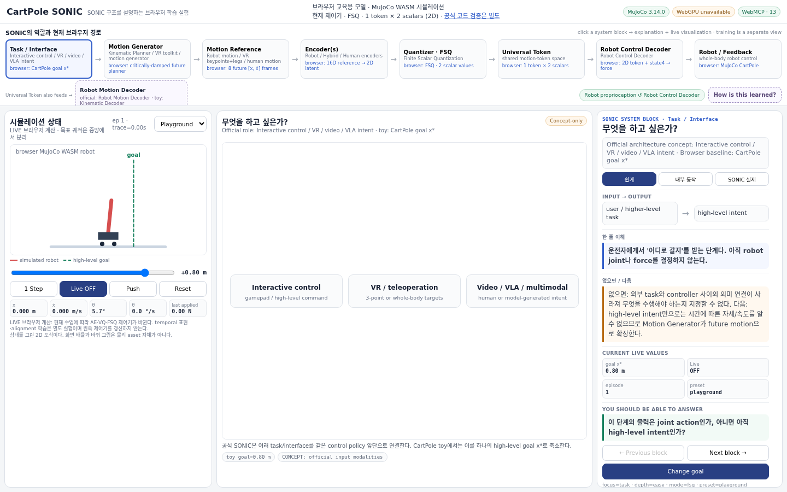

# CartPole SONIC — 작은 로봇으로 이해하는 동작 표현과 제어

[학습장 열기](https://tinmanlab.github.io/cartpole-sonic/)



현재 버전의 실제 브라우저 캡처입니다. 오래된 소개 GIF/MP4 대신 이 화면과 공개 학습장을 기준으로 읽으세요. Native Python 실험 영상은 아닙니다.

**원하는 움직임을 짧은 token으로 표현하고, 그 token과 현재 로봇 상태를 이용해 행동을 결정하는 과정을 살펴보는 공개 학습 자료입니다.** 비공개 저장소나 개인 개발 환경에 접근하지 않아도 브라우저 학습장을 사용할 수 있습니다.

가장 먼저 구분할 점이 있습니다. **브라우저에서 움직이는 것은 JavaScript 교육용 제어 모델과 MuJoCo WASM 시뮬레이션입니다. 공식 SONIC Python 구현은 별도의 native 실험에서 검증합니다.** 실제 물리 엔진을 쓴다는 사실과 공식 SONIC 제어 코드를 실행한다는 사실은 서로 다릅니다. 어떤 경로도 실제 하드웨어를 움직이지 않습니다.

## 1. 전체 흐름: 목표, 계획, 현재 상태는 다릅니다

```text
사용자가 지정한 목표 위치
           ↓
Motion Generator — 앞으로 따라갈 위치·속도 reference 생성
           ↓
Encoder — reference를 작은 연속 표현 z로 변환
           ↓
FSQ — 각 성분을 정해진 단계로 양자화하여 token q 생성
           ↓
Dynamic Decoder ← 현재 시뮬레이터의 위치·속도·각도·각속도
           ↓
카트에 적용할 힘
           ↓
MuJoCo에서 다음 상태 계산 → 다음 제어 입력으로 되먹임
```

별도의 **Kinematic Decoder**는 token으로부터 reference를 복원합니다. 복원 오차는 움직임 정보가 얼마나 남았는지 검사하고 학습을 보조하는 수단입니다. 이 Decoder가 카트에 힘을 주는 것은 아닙니다.

**PPO는 구조의 이름이 아니라 학습 방법입니다.** 물리 시뮬레이션에서 모은 상태·행동·보상을 이용해 정책을 갱신합니다. 작은 token, 낮은 복원 오차, PPO 학습 완료 중 어느 하나만으로 좋은 제어를 보장하지는 않습니다.

## 2. 화면을 읽는 방법

왼쪽은 **현재 브라우저 제어기가 구동하는 시뮬레이션**, 가운데는 **선택한 개념의 시각화**, 오른쪽은 **설명과 입출력의 의미**입니다. 현재 제어기 표시와 시각화의 출처 표시를 함께 확인하세요.

| 표시 또는 값 | 뜻 | 뜻하지 않는 것 |
|---|---|---|
| 실시간 / LIVE | 현재 브라우저에서 계산한 값 | 공식 Python 실험을 실행 중이라는 뜻 |
| 저장된 실험 / EVIDENCE | 파일로 보존된 조건별 실험 결과 | 왼쪽 로봇의 현재 성능이나 방금 수행한 학습 결과 |
| 개념 설명 / CONCEPT | 구조를 설명하는 자료 | 화면의 모든 블록이 현재 제어기에 들어 있다는 뜻 |
| 목표 위치 | 사용자가 원하는 최종 위치 | 현재 reference 또는 실제 위치 |
| 현재 reference | 같은 시각에 따라가야 할 계획 값 | 80ms 뒤의 미리보기 값 |
| 다음 힘 | 현재 상태로 계산한 다음 행동 | 이미 물리에 적용한 마지막 힘 |
| 마지막 적용 힘 | 직전 시뮬레이션 step에 보낸 힘 | 계속 갱신되는 다음 행동 예측 |

추적 오차는 **같은 시각의 실제 위치와 reference**를 비교해야 합니다. 미래 프레임은 Encoder의 입력과 미리보기용이며, `현재 위치 − 80ms 뒤 reference`를 현재 추적 오차로 읽지 않습니다.

로봇 그림은 계산된 상태를 보여 주는 **단순화된 2D 도식**입니다. 그림의 바퀴·색·화면 배율은 실제 하드웨어나 상세 메시의 검증 자료가 아닙니다. 긴 막대 preset에서도 물리 길이는 그대로 두고 화면 배율만 조정합니다.

## 3. 추천 학습 순서

처음에는 기본 FSQ 화면에서 `1 Step`을 눌러 상태와 힘이 바뀌는 것을 확인하세요. 목표를 바꾼 직후 reference/token은 달라질 수 있지만, 로봇은 물리 step 없이 순간 이동하지 않습니다.

다음으로 **Robot Control Decoder**에서 `Push` 전후를 비교하세요. 같은 시각의 reference를 고정하고 실제 상태만 바꾸면, token은 유지되지만 필요한 힘은 달라질 수 있습니다. 이것이 reference와 proprioception을 분리하는 이유입니다.

마지막으로 **Universal Token → Closed-loop 1 vs 2**와 별도의 학습 화면을 비교하세요. Token 개수의 증가, 복원 정확도와 실제 제어 성능은 각각 다른 질문입니다. 특정 한 번의 결과를 token 수의 일반적인 우열로 해석하지 않습니다.

| 기능 | 실제 작동 |
|---|---|
| `1 Step` / `Live` | 선택된 브라우저 제어기로 물리 상태를 진행 |
| `Push` | 시뮬레이터 속도를 순간적으로 변경; 로봇 하드웨어 동작 아님 |
| AE / VQ / FSQ 개념 선택 | 해당 교육용 경로로 바뀔 수 있음; 현재 제어기 표시 확인 |
| 1-token / 2-token 선택 | 해당 비교 화면에서 어느 제어기가 왼쪽 시뮬레이션을 구동할지 지정 |
| Temporal representation / alignment 학습 | 별도 표현 실험; 자동으로 모든 결과가 왼쪽 정책에 반영되는 것은 아님 |
| PPO 학습 버튼 | 명시된 브라우저 모델을 갱신; 저장된 native 평가를 다시 실행하지 않음 |
| Optimizer evidence 화면 | 기록된 실험 조건과 수치를 비교; 버튼으로 데이터가 재학습되는 것은 아님 |

VAE는 배경 개념 비교입니다. VAE 설명을 열었다고 공식 SONIC의 FSQ 경로가 VAE로 바뀌었다고 해석하지 않습니다. VQ는 학습되는 대표 벡터를 사용하고, 이 학습장의 FSQ는 정해진 단계의 숫자를 사용합니다. FSQ 단계 자체에 학습 가중치가 없어도 앞뒤 신경망에는 gradient가 전달됩니다.

## 4. 브라우저 모델의 크기와 물리 조건

일반 브라우저 경로는 미래 위치·속도 **8프레임 × 2성분 = 16개 수**를 입력으로 받습니다. 기본 FSQ 예에서는 이를 **2개 scalar로 된 token 하나**로 줄입니다. 2-token 비교 모델은 **2 tokens × 2 scalars = 4개 수**를 사용합니다. 현재 선택한 모델의 차원과 기본 예제의 차원을 혼동하지 않습니다.

입력에 숫자가 16개 있다고 해서 정보의 자유도가 16개인 것은 아닙니다. 기본 reference는 목표와 시간으로 생성하는 제한된 곡선 집합입니다. 따라서 이 예제에서 좋은 복원 결과가 나와도 복잡한 휴머노이드 동작 전체를 같은 크기로 표현할 수 있다는 뜻은 아닙니다.

| 항목 | 기본 브라우저 설정 |
|---|---|
| 물리 엔진 | MuJoCo JavaScript/WebAssembly |
| 물리 시간 간격 | 0.01초 |
| 제어 간격 | 물리 2 step마다 1회, 즉 0.02초 / 50Hz |
| 실제 상태의 순서 | 카트 위치, 카트 속도, 막대 각도, 막대 각속도 |
| 내부 단위 | m, m/s, rad, rad/s; 화면이 °로 변환할 때 별도 단위 표기 |
| 행동 | 카트에 가하는 힘, 최대 ±10N |
| 기본 모델 | 카트 질량 1kg, 막대 질량 0.1kg, 이동 범위 ±1.8m |

`Long pole`과 `Heavy pole`은 물리 조건 변화용 교육 preset입니다. 다른 preset이나 학습 범위를 벗어난 목표에서, 기본 모델의 저장된 성공률이 그대로 성립한다고 가정하지 않습니다. 이 모델은 카트 힘 하나로 막대의 움직임까지 함께 만들어야 하므로 카트 궤적과 막대 각도를 각각 임의로 명령할 수 없습니다.

## 5. 공식 SONIC 코드로 수행한 별도 실험

Native 경로는 고정된 [공식 SONIC 소스](https://github.com/NVlabs/GR00T-WholeBodyControl/tree/b042411fae38ee4d1af9aac82a37a1f8d14d6dd0)를 직접 불러옵니다. 원본 파일, FSQ 설정, 입출력, 학습 경로와 실험 증거를 확인합니다. 브라우저 모델과 이름이 비슷하다는 것만으로 공식 구현이라고 부르지 않습니다.

| 확인하려는 질문 | 방법·조건·결과 |
|---|---|
| 공식 모듈을 실제로 사용하는가? | [모듈 입출력·역전파 검증](native/README.md) |
| 공식 학습기를 CartPole 물리환경에 연결했는가? | [원본 PPO trainer와 환경 경계](native/TRAINING.md) |
| 단순 균형 유지와 목표 추적을 구분했는가? | [학습된 native 정책과 reference 제거 비교](native/LEARNING.md) |
| 다른 입력 표현이 같은 Decoder를 사용할 수 있는가? | [다중 Encoder·공유 Decoder·복원 실험](native/CONCEPTS.md) |
| 현재·목적지가 같아도 중간 미래를 구분하는가? | [물리적으로 가능한 같은 끝점 궤적 비교](native/TEMPORAL_AUDIT.md) |
| 입력 종류별로 공정하게 학습해도 차이가 남는가? | [동일 예산 재학습·새 궤적 평가·관측 정보 검사](native/MATCHED_CUES.md) |
| 언제 더 큰 로봇이 필요한가? | [검증 가능한 개념과 최소 로봇 전환 기준](native/PIVOT.md) |

실험마다 목표, 데이터, 초기화, 학습 방법, 평가 시간이 다릅니다. 특히 기록 궤적 재생의 mm 단위 오차와 목표 위치 추적의 cm 단위 오차를 같은 지표처럼 직접 비교하지 않습니다. 완주한 episode만의 오차에는 반드시 완주율을 함께 봅니다. 외란 전에 실패했다면 외란 회복값은 0이 아니라 미관측입니다.

짧은 과제의 여러 Encoder 초기화는 전체 제어기를 여러 번 독립 학습한 결과가 아닙니다. 깨끗한 marker 좌표는 실제 카메라나 VR 관측도 아닙니다. 원본 휴머노이드 성능, 장시간 안정성, 실제 센서·하드웨어 또는 sim-to-real 검증을 주장하지 않습니다.

## 6. 직접 실행과 검증

브라우저 학습장은 위 공개 링크에서 실행할 수 있습니다. 로컬 실행에는 저장소를 받아 HTTP 서버로 여세요. `file://`로 HTML을 직접 열면 모듈·WASM 로딩이 제한될 수 있습니다.

```bash
git clone https://github.com/tinmanlab/cartpole-sonic.git
cd cartpole-sonic
npm ci
python3 -m http.server 8765 --bind 127.0.0.1
```

브라우저에서 `http://127.0.0.1:8765`를 엽니다. 선택적인 로컬 telemetry 기능이 필요할 때는 `serve.py`를 사용할 수 있지만, 그 개발용 서버를 인증 없이 외부 네트워크에 공개하는 배포 방법으로 사용하지 않습니다.

```bash
npm run check
npm run verify:contracts
```

Python 실험은 [native 실행 안내](native/README.md)와 [학습 환경 안내](native/TRAINING.md)의 분리된 CPU 환경을 따릅니다. 공개 문서의 예시 경로를 자신의 환경에 맞게 지정하세요. 개인 PC 경로나 다른 비공개 프로젝트가 실행 전제는 아닙니다.

## 7. 기술별 역할

**MuJoCo WASM**은 브라우저 물리 상태를 계산합니다. **JavaScript/CPU**는 교육용 신경망 추론과 작은 학습 실험을 수행합니다. **WebGPU**는 FSQ 계산의 CPU/GPU 일치 여부를 검사하는 선택 기능이며, 학습 전체가 GPU에서 실행된다는 뜻은 아닙니다. **WebMCP**는 화면에서 사용하는 것과 같은 탐색·실험 기능을 도구로 노출합니다.

`course.js`의 구조와 설명은 화면과 WebMCP가 공유합니다. `sonic_get_state`에서 제공하는 상태·reference·token·힘에도 어떤 모델과 어떤 시각의 값인지 구분이 필요합니다. 저장된 실험 파일은 현재 실행 상태와 별도 자료입니다.

## 출처와 재사용 경계

공식 프로젝트와 공개 라이브러리의 정당한 출처는 유지합니다. 출처를 적는 것과 그 프로젝트의 성능·모든 기능을 재현했다고 주장하는 것은 다릅니다.

- [GEAR-SONIC 공식 프로젝트](https://nvlabs.github.io/GEAR-SONIC/)와 [공식 코드·문서](https://github.com/NVlabs/GR00T-WholeBodyControl)
- [Finite Scalar Quantization 구현](https://github.com/lucidrains/vector-quantize-pytorch)
- [MuJoCo](https://github.com/google-deepmind/mujoco), [MuJoCo Playground](https://github.com/google-deepmind/mujoco_playground), [DeepMind Control Suite](https://github.com/google-deepmind/dm_control)
- [포함된 라이선스와 제3자 고지](THIRD_PARTY_NOTICES.md)

교육용 teacher와 student checkpoint는 이 저장소에 포함되어 있으며, 공개 출처 메타데이터와 원시 실험 파일은 재현성 자료로 보존합니다. 비공개 저장소 이름, 개인 접근 경로, 내부 작업 지시는 일반 학습 설명에 필요하지 않습니다. 과거 Git 이력을 재작성하거나 정당한 원출처를 지우는 방식으로 공개 자료를 정리하지 않습니다.
